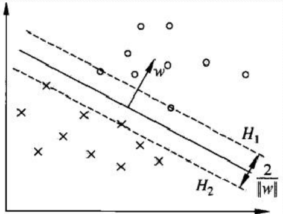

# SVM系列1
支持向量机是一种二类分类模型。它的基本模型是定义在特征空间上的间隔最大的线性分类器[^1]。

#### 基础知识
- 点到直线距离[^2]
- 间隔距离[^3]
- 拉格朗日乘子法[^4]

#### 线性间隔公式推导
- 硬间隔[^5]
- 软间隔[^5]

#### 核函数使用
- 公式推导[^6]

#### SMO
- 求值过程[^7]

[^1]: 统计学习方法第7章
[^2]: https://zhuanlan.zhihu.com/p/30487021
[^3]: https://zhuanlan.zhihu.com/p/118675053
[^4]: https://www.zhihu.com/question/38586401/answer/105588901
[^5]: https://zhuanlan.zhihu.com/p/122519336
[^6]: https://zhuanlan.zhihu.com/p/125735325
[^7]: https://gitlab.com/wqw547243068/lihang-code/-/blob/master/ppt/%E7%AC%AC7%E7%AB%A0%20%E6%94%AF%E6%8C%81%E5%90%91%E9%87%8F%E6%9C%BA.pdf

------
permalink: /posts/